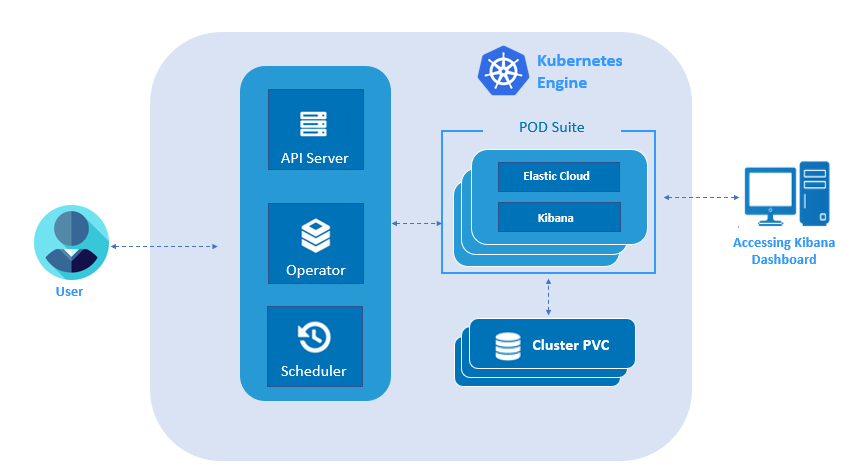

# Elastic Cloud on Kubernetes (ECK)

Elastic Cloud on Kubernetes automates the deployment, provisioning, management, and orchestration of Elasticsearch, Kibana, APM Server, Enterprise Search, and Beats on Kubernetes based on the operator pattern.

Current features:

*  Elasticsearch, Kibana, APM Server, Enterprise Search, and Beats deployments
*  TLS Certificates management
*  Safe Elasticsearch cluster configuration & topology changes
*  Persistent volumes usage
*  Custom node configuration and attributes
*  Secure settings keystore updates

**Elastic Cloud Operator Architectural Flow**

To create elastic-cloud user need to install olm and deploy elastic cloud operator on kubernetes. elastic cloud operator is used to create instances and with help of kibana we can access elastic cloud. This instances will be used by external applications

Supported versions:

*  Kubernetes 1.12+ or OpenShift 3.11+
*  Elasticsearch, Kibana, APM Server: 6.8+, 7.1+
*  Enterprise Search: 7.7+
*  Beats: 7.0+

For general questions, please see the Elastic [forums](https://discuss.elastic.co/c/eck).
